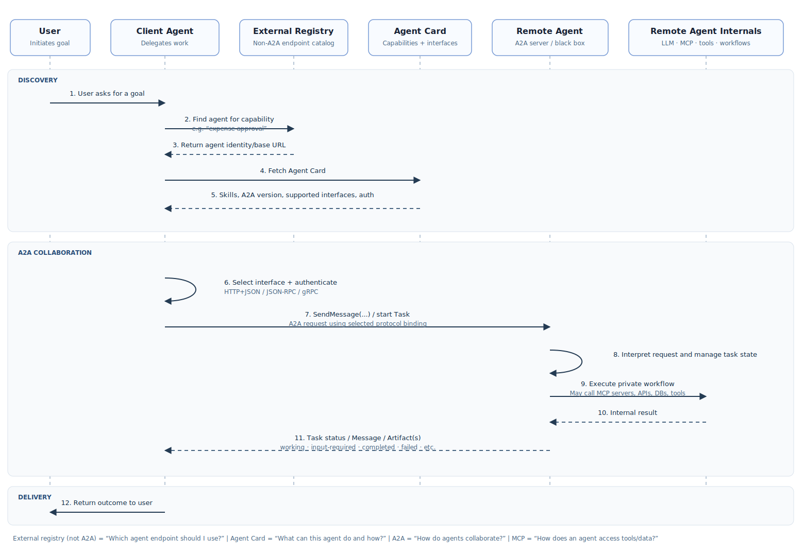

# Agent2Agent (A2A)

## Overview

A2A is an application-layer protocol for one agent (the client) to discover and
communicate with another agent (the server). The server advertises an Agent Card,
accepts messages, and may reply immediately or manage longer-running work as a Task.
This kit targets A2A specification **v1.0.1** and uses the official Python SDK's v1
protobuf models and JSON-RPC over HTTP binding.

## Typical use cases

- Discovering an agent's endpoint, skills, accepted media types, and security needs.
- Delegating work that completes immediately or continues asynchronously.
- Streaming task status and artifact chunks to a caller.
- Continuing a conversation by retaining its context ID across messages or tasks.
- Looking up, listing, subscribing to, and conditionally cancelling tasks.

## Core capabilities

The v1 protocol defines Agent Cards and skills, Messages containing typed Parts,
direct Message responses, stateful Tasks with history and Artifacts, streaming via
server-sent events, task lookup/list/cancellation/subscription, multiple transport
bindings, security declarations, tenants, and extension identifiers.

## Lifecycle



The registry in this diagram is an **external component**, not part of A2A. In the
example it stores role-to-endpoint mappings only. The user program resolves the local
endpoint and the local agent resolves the two remote endpoints there; standard A2A
discovery then retrieves each Agent Card from the endpoint's
`/.well-known/agent-card.json` URL.

## Security

An Agent Card declares supported security schemes and requirements. Enforcement is
an application/server responsibility. Protect the RPC endpoint using standard HTTP
authentication and authorize every operation; do not treat card declarations as
enforcement. URL Parts are references only in this kit and are never fetched
automatically, avoiding an implicit server-side request boundary. The included
three-agent example deliberately keeps discovery public while requiring bearer
authentication on every user-to-agent and agent-to-agent RPC call. Its static demo
tokens are not suitable for production.

Signed Agent Cards are optional. `sign_agent_card()` adds a JCS/JWS signature;
`verify_agent_card()` checks a discovered card before its interfaces are used when
passed to `A2AClient(card_verifier=...)`. The caller supplies a key source that
receives the protected `kid` and optional `jku`, returns the matching public key,
its source, and its expiry/revocation state. The kit does not fetch an untrusted
`jku` automatically. A verified signature identifies the signing key; the caller
decides which keys or providers to trust.

For rotation, publish signatures from both keys while verifiers can resolve both.
The verifier accepts a card when at least one signature uses a valid, current key;
retired keys can then be marked revoked in the key source. Expired or revoked keys
are never accepted. The verified key ID and source are returned to the caller.

## Optional Send Message idempotency

Enable `messageId` replay protection on a server with
`create_server(card, executor, message_idempotency=MessageIdempotencyOptions())`.
The same `messageId`, method, message, configuration, and requested extensions
return the first result or ordered stream without another executor dispatch.
Reusing an ID with different request content returns JSON-RPC invalid parameters.
Concurrent duplicates wait for the first result, up to `wait_timeout_seconds`.

The cache is scoped by tenant and authenticated username; anonymous callers share
one scope per tenant. Configure `scope_resolver` if the application needs a different
trusted caller identity. Entries expire `retention_seconds` after completion.
`max_entries` and `max_cached_events` bound retention; a full cache, an interrupted
original request, or a stream over the replay limit fails closed for duplicates.
This store is process-local: use one server process for this guarantee. The protocol
allows Send Message idempotency but does not require every server to offer it.

## Specification

- [A2A specification v1.0.1](https://a2a-protocol.org/latest/specification/)
- [Official A2A Python SDK](https://github.com/a2aproject/a2a-python)
- [A2A Technology Compatibility Kit](https://github.com/a2aproject/a2a-tck)

The dependency is constrained to `a2a-sdk[http-server,signing]>=1.1.2,<2`. This kit does
not enable the SDK's v0.3 compatibility layer.

## Implementation coverage in this kit

Implemented:

- Well-known Agent Card discovery; skills, modes, capabilities, security, and
  extension declarations.
- Optional JCS/JWS Agent Card signing and verification during discovery, with
  caller-provided key resolution and key-status checks.
- Optional `messageId` idempotency for both Send Message methods in one process.
- v1 JSON-RPC over HTTP with SDK interface selection, `A2A-Version`, and tenant
  propagation.
- Text, structured data, URL, and inline raw-byte Parts. URL retrieval is left to
  application policy.
- Direct Message responses and Task responses.
- Blocking and `returnImmediately` message configuration.
- In-memory task state, history, status, ordered/appendable Artifacts, get/list,
  cancellation calls, streaming, subscription/reconnection, and context continuity.
- Authentication middleware hooks and a tested three-agent flow in which every
  Agent Card declares bearer security and every RPC endpoint enforces it.
- LLM-backed facts and review specialists plus an LLM-backed local coordinator;
  specialists' A2A Message responses become the coordinator's synthesis evidence.

Deliberately deferred: REST and gRPC bindings, push notifications, extended
Agent Cards, extension-specific behavior, full multi-tenant hosting, v0.3
compatibility, and durable SQL persistence. The in-memory store loses state on
process restart. Push notification support remains deferred because receivers and
sender URLs introduce additional authentication and SSRF controls.

## Module map

- `src/agent_protocols/a2a/cards.py` — Agent Skill and v1 JSON-RPC Agent Card builders.
- `src/agent_protocols/a2a/server.py` — Starlette routes, handler, injected/default
  task store, middleware hooks, and shutdown.
- `src/agent_protocols/a2a/client.py` — discovery and message/task client operations.
- `src/agent_protocols/a2a/signing.py` — Agent Card JCS/JWS signing and verification.
- `src/agent_protocols/a2a/idempotency.py` — bounded Send Message replay protection.
- `examples/a2a/local_agent.py` — an A2A coordinator that combines two remote responses.
- `examples/a2a/facts_agent.py` and `review_agent.py` — specialist remote A2A agents.
- `examples/a2a/user.py` — the human-facing client that contacts the local agent over A2A.
- `examples/a2a/registry.py` — the external role-to-endpoint registry.
- `examples/a2a/security.py` — shared bearer declarations and enforcement for the example.
- `src/agent_protocols/utils/llm_client.py` — the reusable OpenAI-compatible
  `generate_text()` boundary used by all three agents.

## Usage

1. Install the A2A extra: `uv sync --extra a2a`.
2. Configure the shared LLM endpoint in `.env` or the shell:

   ```dotenv
   LLM_BASE_URL=https://your-openai-compatible-endpoint/v1
   LLM_API_KEY=your-key
   LLM_MODEL=your-model
   ```

3. Start the facts agent: `uv run python -m examples.a2a.facts_agent`.
4. Start the review agent: `uv run python -m examples.a2a.review_agent`.
5. Start the local coordinator: `uv run python -m examples.a2a.local_agent`.
6. Run the human-facing program: `uv run python -m examples.a2a.user`.
7. Enter a question. The user program authenticates to the local agent; the local
   agent discovers and authenticates to both remote agents concurrently, combines
   their LLM-generated Messages with its own LLM call, and returns one A2A Message
   to the user. The example allows up to five minutes for each A2A call because an
   LLM response commonly exceeds the short HTTP client default.

The three default demonstration tokens can be overridden with
`A2A_LOCAL_AGENT_TOKEN`, `A2A_FACTS_AGENT_TOKEN`, and `A2A_REVIEW_AGENT_TOKEN`.

Minimal client usage:

```python
from agent_protocols.a2a import A2AClient, Role, new_text_message

async with A2AClient("http://127.0.0.1:8000") as client:
    request = new_text_message("Draft a title", role=Role.ROLE_USER)
    async for response in client.send_message(request):
        print(response.WhichOneof("payload"))
```

## Known limitations / deviations

The example registry is process-local and static; it demonstrates endpoint lookup,
not an A2A registry standard. Cancellation is cooperative: an executor must implement
`cancel()` and publish the cancelled state. Extension fields are transported and
advertised without specialized processing.

The official TCK is the conformance authority. A JSON-RPC MUST-level run from TCK
commit `263b9cf` against the earlier single writing-agent example produced 66 passes,
6 failures, and 163 skips. Five failures require fixture-specific agent outputs (particular text,
raw-file, URL-file, data, and direct-Message responses), which the general example
does not synthesize. The remaining failure is a real SDK 1.1.2 deviation: subscribing
to a terminal task returns JSON-RPC `-32602` (invalid parameters) instead of the
required `-32004` (unsupported operation). The local tests validate successful
subscription/reconnection while a task is active; they do not mask this terminal-task
error-code difference.
