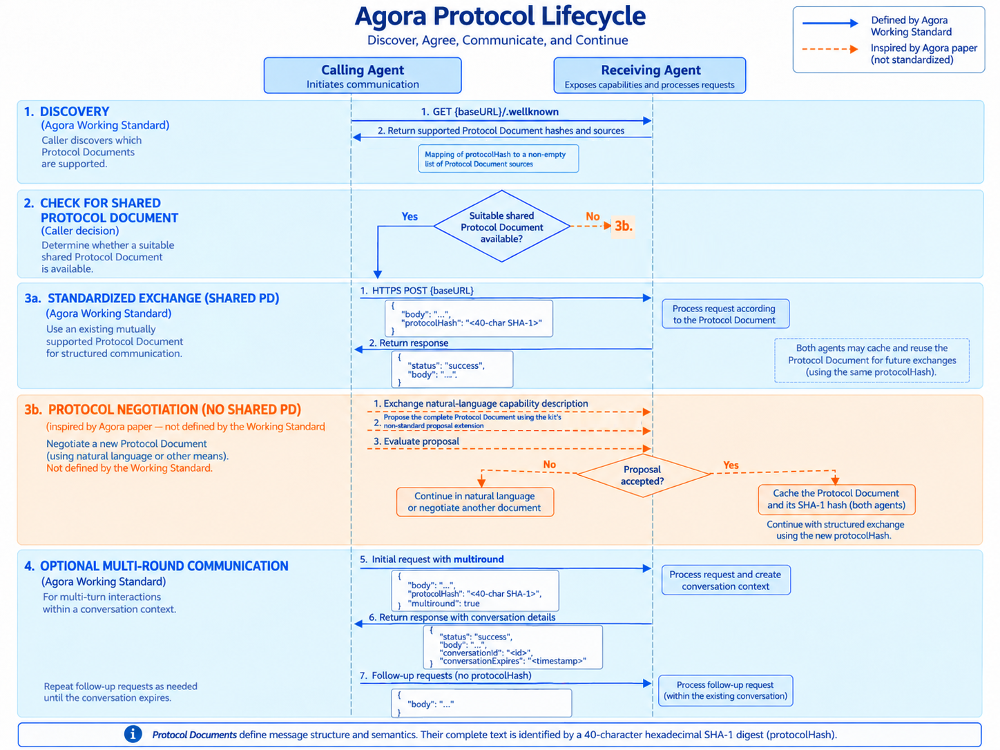

# Agora

## Overview

Agora is a meta-protocol for communication between heterogeneous agents. Its paper proposes that
agents use established protocols for frequent exchanges, natural language for rare exchanges,
and create reusable protocols for cases between those extremes. The later Working Standard
defines a smaller interoperable base: JSON envelopes, Protocol Documents (PDs), discovery,
single- and multi-round exchanges, and layered errors.

## Typical use cases

- Two unfamiliar agents need to find a message format they both support.
- Agents initially communicate in natural language, then adopt a structured format for repeated
  calls.
- A network wants to reuse compact domain-specific exchanges without requiring one universal
  application protocol.

## Core capabilities

The Working Standard defines two-party JSON exchanges over HTTP POST. A request carries a `body`
and may select a PD by `protocolHash`. A PD contains YAML metadata and free-form interaction rules;
the SHA-1 digest of its complete text identifies it. A server can advertise supported hashes at
`{baseURL}/wellknown`, and `multiround: true` can establish a stateful conversation. The broader
paper adds selection, natural-language fallback, protocol creation, and reuse as the
meta-protocol strategy, without standardizing their negotiation messages.

## Lifecycle



Blue arrows show behavior defined by the Working Standard. Orange dashed arrows show the
paper-inspired negotiation path implemented as a non-standard extension by this kit.

For a standard multi-round exchange, the first POST instead includes `multiround: true`. The
server returns `conversationId` and `conversationExpires`; follow-ups go to
`{baseURL}/conversations/{conversationId}` without repeating or changing the PD.

The example demonstrates both branches against one LLM-backed calculator. A preconfigured
requester discovers a PD it already shares with the calculator and asks `What is 10 - 3?` in one
structured, single-round call. A different requester has no compatible PD, asks about the same
calculator's capability in natural language, and the calculator's LLM answers that inquiry. The
requester gives the response to its own LLM, which creates a complete declarative calculation PD.
If the calculator rejects it, the requester gives the rejected PD and reason to its LLM for one
revision. After acceptance, the requester's LLM reads the capability and accepted PD and forms
`What is 2 + 2?` from a calculation goal. It forms `What is 7 * 6?` as the follow-up and sends it
through the returned `conversationId`, without resending `protocolHash`.

## Security

The Working Standard requires HTTPS for production but leaves authentication, authorization, and
key management out of scope. Applications must add those controls separately. PD hashes identify
exact document text; SHA-1 here is an interoperability identifier and should not be treated as a
modern signature or trust proof. Implementations must also treat received PDs and message bodies
as untrusted input.

This kit parses PD metadata, and the example application validates received JSON bodies. Its
negotiation extension never executes generated code. The runnable local example uses loopback HTTP
for development, so it does not demonstrate the standard's production transport requirement or
peer authentication.

## Specification

- [Agora Working Standard](https://agoraprotocol.org/docs/protocol/specification), last updated
  2025-01-19. It identifies itself as a draft Proposed Standard.
- [*A Scalable Communication Protocol for Networks of Large Language Models*](https://arxiv.org/abs/2410.11905),
  arXiv:2410.11905, submitted 2024-10-14.

The kit implements the formal exchange directly. It does not depend on the open-beta official
Python library because its automatic negotiation behavior is broader than the Working Standard.

## Implementation coverage in this kit

| Capability | Current coverage |
|---|---|
| Request and response envelopes | String/object bodies, success/failure, strict core-field validation |
| Protocol Documents | Required YAML metadata, exact source preservation, 40-character hexadecimal SHA-1 |
| Discovery | Publish and consume `{baseURL}/wellknown`; select a shared hash |
| Single-round exchange | Natural-language or PD-selected structured calls |
| Multi-round exchange | Initiation, opaque conversation ID, expiry, follow-up route, fixed PD |
| Error separation | HTTP 400/404 for malformed transport requests; HTTP 200 Agora failures; PD errors inside successful bodies |
| PD negotiation | Kit extension for proposal, application evaluation, actionable rejection reasons, acceptance, and caching |
| PD proposal | Requester LLM creates declarative rules from the calculator's capability response; calculator validates them and asks its LLM to accept or reject with a reason |
| Shared-PD path | Calculator advertises a PD known by one requester and handles its single-round call without negotiation |
| Authentication and authorization | Not implemented because the Working Standard leaves them to applications |

## Module map

- `src/agent_protocols/agora/protocol.py` — PD parsing, hashing, and in-memory registry.
- `src/agent_protocols/agora/messages.py` — JSON envelope models and validation.
- `src/agent_protocols/agora/server.py` — discovery, exchange, and conversation ASGI routes.
- `src/agent_protocols/agora/client.py` — discovery, shared-PD selection, and calls.
- `src/agent_protocols/agora/negotiation.py` — explicitly non-standard proposal extension.
- `examples/agora/calculator_agent.py` — proposal review and LLM-backed calculations.
- `examples/agora/shared_requester_agent.py` — pre-shared PD and one-time structured call.
- `examples/agora/requester_agent.py` — discovery, LLM-authored PD negotiation, LLM question
  formation, conversation start, and follow-up.

## Usage

Install the Agora extension:

```bash
uv sync --extra agora
# Or: pip install ".[agora]"
```

Configure the shared LLM settings described in the repository README. Start each agent in a
separate terminal:

```bash
# Terminal 1
uv run python -m examples.agora.calculator_agent
# Terminal 2, run once
uv run python -m examples.agora.shared_requester_agent
# Terminal 3
uv run python -m examples.agora.requester_agent
```

The shared requester uses its pre-shared PD without negotiation or an LLM. The other requester asks
for the calculator's capability, uses its LLM to create a PD from that response, and proposes it.
After acceptance, the same LLM forms two questions that are sent in one multi-round conversation.
The calculator caches the accepted PD in memory. This requester is a one-shot program, so a new
process negotiates again; a long-running requester could retain the PD and discover it as shared.

Applications can use the standards-based layer without the negotiation extension:

```python
from agent_protocols.agora import AgoraClient, ProtocolDocument

document = ProtocolDocument.parse(protocol_document_text)
async with AgoraClient("https://agent.example/agora") as client:
    response = await client.exchange(
        {"question": "What changed?"},
        protocol=document,
    )
```

## Known limitations / deviations

The Working Standard is a draft and leaves some details underspecified. This kit treats
`protocolSources` and `wellknown` sources as strings, keeps protocol and conversation state only
in memory, and implements one base-URL layout. It ignores unknown request fields as required but
does not provide distributed PD storage, protocol suitability ranking, persistence, streaming,
or recovery beyond one reason-guided proposal revision.

The calculator example's compatibility check recognizes required concepts in PD text and then asks
an LLM for the acceptance decision; it is not a general semantic validator or JSON Schema engine.

The proposal body type `agent-protocols-reference-kit/agora-proposal-v1` and its acceptance
response are local conventions inspired by the paper; they are not Working Standard fields. The
requester LLM creates a declarative PD from the calculator's capability response; the calculator
checks it against capability rules, asks its LLM to accept or reject it, and uses the LLM for
arithmetic answers. Local HTTP, deterministic test LLMs, and process-local caching do not show
production TLS, identity, authorization, durability, or arbitrary generated routines.
