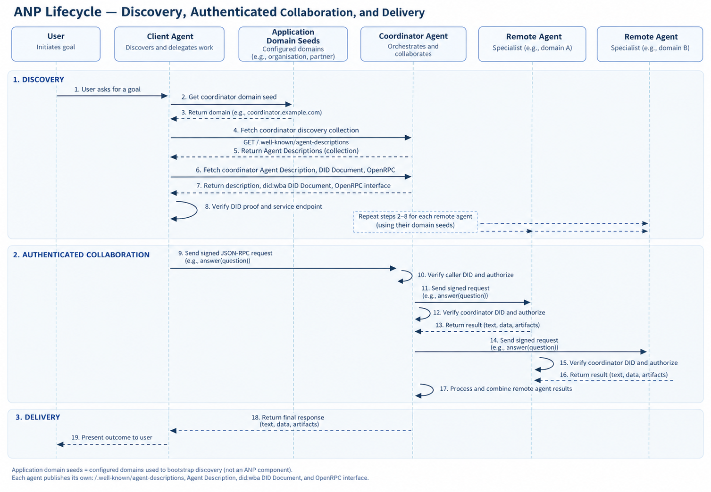

# Agent Network Protocol (ANP)

## Overview

ANP lets agents publish a discoverable description of their identity and interfaces, then use
those interfaces across platforms. This kit follows the released ANP **1.1** identity,
description, and discovery documents for one path: find an agent under a domain, bind its
description URL to a `did:wba` identity, and invoke a typed OpenRPC-described JSON-RPC method.
The main example uses the same facts, review, and coordinator scenario as the A2A example.

## Typical use cases

- Finding public agents when only their hosting domain is known.
- Checking which DID claims an advertised agent URL before interacting with it.
- Describing and calling a structured method with DID-based HTTP authentication.

## Core capabilities

The released suite defines `did:wba` web identities and authentication (ANP-03), WNS names
(ANP-04), Agent Descriptions and interfaces (ANP-07), active and passive discovery (ANP-08),
messaging profiles (ANP-09), and payments (ANP-10). An Agent Description can list natural
language or structured interfaces, including OpenRPC. These are protocol capabilities; the kit
implements the narrower active-discovery and OpenRPC path described in its coverage table.

## Lifecycle

An ANP agent may publish its own identity and interfaces, call another agent, or do both. The
general path across [ANP-03 identity and authentication](https://github.com/agent-network-protocol/AgentNetworkProtocol/blob/v1.1/03-did-wba-method-design-specification.md),
[ANP-07 Agent Description](https://github.com/agent-network-protocol/AgentNetworkProtocol/blob/v1.1/07-anp-agent-description-protocol-specification.md),
and [ANP-08 discovery](https://github.com/agent-network-protocol/AgentNetworkProtocol/blob/v1.1/08-ANP-Agent-Discovery-Protocol-Specification.md) is:

1. **Publish.** The host serves a `did:wba` DID Document and an Agent Description that names the
   agent, its DID, capabilities, interfaces, and security requirements. Public agents can list
   their Agent Description URLs in a domain's well-known discovery collection. An agent may
   instead register its description with a search service for passive discovery.
2. **Discover.** Starting from a known domain, a caller fetches
   `/.well-known/agent-descriptions`, follows any `next` pages, and fetches a selected Agent
   Description URL. Passive discovery can supply that URL through a search service instead.
3. **Check identity and choose an interface.** The caller resolves the advertised DID Document
   over HTTPS, verifies the DID binding and any required proof, and checks the Agent Description
   association when the DID Document advertises that service. It then reads the description's
   security declaration and chooses a suitable natural-language or structured interface. An
   interface definition, such as OpenRPC, describes how to call it.
4. **Authenticate and interact.** For a `did:wba`-secured HTTP interface, the first request uses
   an HTTP Message Signature and includes `Content-Digest` when it has a body. The host resolves
   and verifies the caller DID, then separately authorizes access. It may issue a bearer token
   for later requests. The selected interface determines the actual request and response; this
   kit uses an OpenRPC-described JSON-RPC method returning text.
5. **Use the result.** The caller processes the interface's response and may in turn discover
   and call other agents. Coordination, LLM use, and the form of a user-facing answer belong to
   the application, not to this identity-and-discovery lifecycle.

The diagram below illustrates this path in this kit's facts, review, and coordinator application:



The diagram compresses several requests: the discovery collection returns Agent Description
**links**, not the descriptions themselves; the caller fetches the description and DID Document
separately, verifies their association, and makes an authenticated GET for the OpenRPC interface.
The client agent discovers the coordinator, which repeats discovery for the facts and review
agents using application-configured domain seeds. All three `answer(question)` calls use signed
JSON-RPC requests; in this kit they return text strings. The figure's "data" and "artifacts"
labels indicate possible application outputs, not this method's result or an ANP Task model.
The specialists and coordinator use the shared LLM client internally, which the figure omits.

## Security

ANP-03 resolves `did:wba` documents through DNS-named HTTPS with normal TLS certificate
validation. For an `e1_` path DID, the final segment binds an Ed25519 authentication key; the
DID Document carries a required signed Data Integrity proof. First requests use RFC 9421 HTTP
Message Signatures, and requests with bodies bind RFC 9530 `Content-Digest`. A successful signed
request may issue a bearer token in the `Authentication-Info` response header. Signature
verification establishes a caller DID; the host still decides whether that DID may call the
method. ANP-07 also defines an optional proof over an Agent Description body.

## Specification

- [Tagged ANP 1.1 release](https://github.com/agent-network-protocol/AgentNetworkProtocol/releases/tag/v1.1),
  [ANP-03 `did:wba`](https://github.com/agent-network-protocol/AgentNetworkProtocol/blob/v1.1/03-did-wba-method-design-specification.md),
  [ANP-07 Agent Description](https://github.com/agent-network-protocol/AgentNetworkProtocol/blob/v1.1/07-anp-agent-description-protocol-specification.md),
  and [ANP-08 discovery](https://github.com/agent-network-protocol/AgentNetworkProtocol/blob/v1.1/08-ANP-Agent-Discovery-Protocol-Specification.md).
- [OpenRPC specification](https://spec.open-rpc.org/) (the ANP-07 example uses 1.3.2) and
  [JSON-RPC 2.0 specification](https://www.jsonrpc.org/specification).

ANP 1.1 is the released document-suite tag. Its example payloads use
`protocolVersion: "1.0.0"`; the interface document uses `openrpc: "1.3.2"`. The Python helper
dependency is pinned to [`anp` 1.0.3](https://pypi.org/project/anp/1.0.3/) because the resolver
adapter relies on that SDK's signature and token operations.

## Implementation coverage in this kit

| Capability | Current coverage |
|---|---|
| `e1_` DID and proof | Generate, publish in the example, and verify ID, fingerprint, and signed proof |
| ANP-03 authentication | Signed first requests, body digest, nonce/time checks, `Authentication-Info` token, bearer follow-up; legacy DIDWba header disabled |
| ANP-07 Agent Description | Generate required shape and did:wba security declaration; verify exact DID service link back to its URL |
| ANP-08 active discovery | Well-known JSON-LD collection, named items, `next` pagination, HTTPS fetching |
| Structured interface | Reusable one-string-input/output OpenRPC 1.3.2 method over JSON-RPC 2.0 HTTP |
| JSON-RPC behavior | IDs, named/positional parameters, errors, notifications, and basic batches for the selected method |
| Local HTTP trust flow | DNS-name certificate, controlled loopback resolver, actual TLS requests for publication, DID resolution, and calls |

The facts–review–coordinator example showcases these implemented features across three agents:
each publishes its own DID, Agent Description, discovery collection, and OpenRPC interface; the
coordinator discovers and makes authenticated calls to both specialists. Their roles and
synthesis are application behavior, not ANP features. The example explicitly authorizes caller
DIDs. Discovery, Agent Description, and DID documents are public; OpenRPC interface documents
and RPC endpoints require authentication. A one-agent test fixture uses the retained `greet`
wrapper to verify signed first requests, bearer follow-up, and JSON-RPC error behavior.

## Module map

- `src/agent_protocols/anp/identity.py` — e1 DID generation, proof check, SDK auth helpers.
- `src/agent_protocols/anp/verifier.py` — verifier adapter for a host-provided HTTPS DID resolver.
- `src/agent_protocols/anp/discovery.py` — ANP-07/08 builders, active discovery, DID service link.
- `src/agent_protocols/anp/interface.py` — typed OpenRPC method description and validation.
- `src/agent_protocols/anp/server.py` — HTTPS document routes and authenticated JSON-RPC handler.
- `src/agent_protocols/anp/client.py` — discovery and authenticated method client.
- `examples/anp/local_https.py`, `setup.py`, and `demo_common.py` — local TLS, DID setup,
  publication, and authorization helpers.
- `examples/anp/facts_agent.py`, `review_agent.py`, and `coordinator_agent.py` — separate
  LLM-backed HTTPS agent servers.
- `examples/anp/user.py` — human-facing discovery and question-answering client.

## Usage

From the repository root, install the ANP extra with `uv sync --extra anp` (or
`pip install ".[anp]"`). Configure `LLM_BASE_URL`, `LLM_API_KEY`, and `LLM_MODEL` in `.env` or
the environment. Prepare the local TLS certificate and DID credentials once **before** starting
the servers:

```bash
uv run python -m examples.anp.setup
```

Start each agent in a separate terminal, then run the user program in a fourth:

```bash
# Terminal 1
uv run python -m examples.anp.facts_agent
# Terminal 2
uv run python -m examples.anp.review_agent
# Terminal 3
uv run python -m examples.anp.coordinator_agent
# Terminal 4, after the servers start
uv run python -m examples.anp.user
```

Enter a question, or press Enter for `What should we know before adopting ANP?`. The caller
discovers and authenticates to the coordinator; the coordinator discovers both specialists,
calls their `answer` methods, and uses the LLM to synthesize their LLM-generated replies. Each
server prints its publication, authorization, and answering actions. The servers use separate
DNS-named HTTPS origins on loopback ports 8100–8102, local certificate trust, and explicit
caller-DID rules. Setup writes temporary keys under the ignored `.anp-demo/` directory; stop
the servers before re-running setup because it replaces their identities and TLS trust.

Applications use the same public client pattern with their own published identities and HTTPS
endpoints:

```python
from agent_protocols.anp import ANPClient, create_http_authenticator

authenticator = create_http_authenticator("caller-did.json", "caller-key.pem")
async with ANPClient(authenticator) as client:
    agents = await client.discover("agents.example.com")
    answer = await client.answer(
        agents[0], "What should we check?", force_new_signature=True
    )
    print(answer)
```

Use a separate client and authenticator for each server origin. In particular, the coordinator
uses separate authenticated clients for facts and review.

## Known limitations / deviations

This is a tested path, not general ANP 1.1 conformance. The kit does not verify the
optional Agent Description body proof; DID-to-URL association does not sign the AD contents.
Its e1 DID consumer validates the generated JSON Document shape and proof, without general
JSON-LD DID processing. The client requires collection pages, description URLs, and interface
URLs on the discovered domain; the method endpoint is on that domain too. Its typed-method API
supports one string parameter and one string result. The examples do not cover passive search
registration, WNS handles, messaging, payments, other interface types, or draft meta-protocol
negotiation. The coordinator and role-to-domain seeds are application behavior, not ANP-defined
roles or A2A task semantics.

The local demonstration supplies its own trusted certificate and DNS mapping; it does not test
public DNS, a production certificate authority, key custody, durable nonce state, or production
authorization policy. The verifier adapter uses SDK 1.0.3 behavior pinned by the dependency;
SDK updates require renewed specification review and tests.
