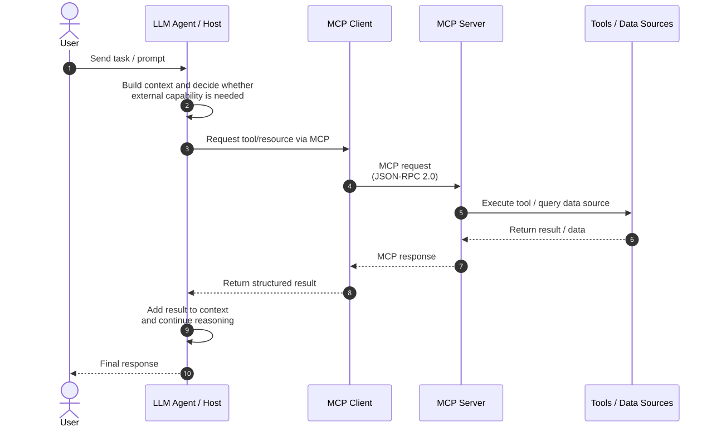

# MCP (Model Context Protocol)

## Overview

MCP is an open protocol for connecting AI applications to external data and capabilities through
a consistent interface. A host application creates MCP clients that communicate with MCP servers
using JSON-RPC 2.0. Servers can expose data, reusable prompt templates, and callable functions
without requiring each host to implement a service-specific integration.

## Typical use cases

- **Development tools** — give coding assistants controlled access to repositories, debuggers,
  build systems, issue trackers, and deployment tools.
- **Knowledge access** — make documents, databases, and internal knowledge sources available as
  structured context instead of copying their entire contents into prompts.
- **External actions** — let an agent call APIs or business operations through described,
  schema-validated tools.
- **Reusable workflows** — publish prompt templates that guide users and models through common
  tasks with consistent inputs.
- **Composable integrations** — allow one host to connect to multiple focused local or remote
  servers through the same protocol.

## Core capabilities

MCP separates three principal roles:

- The **host** is the AI application. It coordinates the model, user interaction, permissions,
  and one or more MCP clients.
- A **client** is the connector inside the host that communicates with a particular server.
- A **server** publishes context or actions and may connect to files, databases, APIs, or other
  external systems.

The 2026-07-28 base protocol uses stateless, self-contained JSON-RPC requests with per-request
protocol and capability metadata. Its main server-provided primitives are:

- **Tools** — named functions, described by JSON Schema, that a model can discover and invoke.
- **Resources** — URI-addressed data that a client can list and read for use as context.
- **Prompts** — parameterized message templates that a server makes available to users and hosts.

Clients may support **elicitation**, allowing a server to request additional user input while
handling an operation. The base protocol also defines progress reporting, cancellation, and error
handling. Opt-in extensions add capabilities such as long-running tasks and interactive MCP Apps.

## Lifecycle

The host builds the model context and uses an MCP client to access a server. In a typical tool-use
flow, the client obtains the available tools, the host gives their schemas to the model, and a
model-selected tool call is sent to the server. The server invokes the underlying capability and
returns a structured result, which the host adds to the model context before producing a response.
The model does not connect to the MCP server directly.



Editable diagram source: [`assets/mcp-lifecycle.mmd`](assets/mcp-lifecycle.mmd).

## Security

MCP creates a boundary between an AI application and systems that may expose sensitive data or
perform consequential actions. The protocol therefore places responsibility for consent and
policy enforcement on the host:

- Users should understand and explicitly approve data access and tool execution. Tool metadata
  received from an untrusted server must itself be treated as untrusted.
- Hosts should isolate connections, disclose which servers and tools are available to the model,
  and avoid sharing resource data with other parties without user consent.
- Tools can execute arbitrary operations; hosts should validate inputs, apply least privilege,
  show confirmation for sensitive actions, and retain a human-controlled denial path.

Authorization is optional at the protocol level and depends on the transport. HTTP-based
deployments should follow MCP's OAuth 2.1 authorization profile, including protected-resource and
authorization-server discovery, PKCE, least-privilege scopes, issuer validation, audience-bound
access tokens, and HTTPS. Tokens must not be passed through to unrelated upstream services. For
stdio, the specification advises obtaining credentials from the process environment instead of
using the HTTP authorization flow.

These are protocol requirements and recommendations. The next section states which protections
are present in this reference kit.

## Specification

- Target revision: [MCP specification 2026-07-28](https://modelcontextprotocol.io/specification/2026-07-28).
- Security details: [MCP authorization specification](https://modelcontextprotocol.io/specification/2026-07-28/basic/authorization).
- Capability details: [tools](https://modelcontextprotocol.io/specification/2026-07-28/server/tools),
  [resources](https://modelcontextprotocol.io/specification/2026-07-28/server/resources), and
  [prompts](https://modelcontextprotocol.io/specification/2026-07-28/server/prompts).
- This kit uses the official Python SDK (`mcp` 2.1.1) rather than reimplementing the wire
  protocol. The SDK identifies `2026-07-28` as its latest protocol version and retains
  compatibility behavior for older peers.

## Implementation coverage in this kit

Implemented:

- **stdio transport** — the client starts a server subprocess and communicates over its standard
  input and output streams.
- **Tools** — list and call, including structured success and error results.
- **Resources** — list and read.
- **Prompts** — list and get, including argument substitution.
- **SDK-managed protocol handling** — request metadata, discovery/version compatibility, and
  JSON-RPC communication are delegated to the official SDK.
- **LLM tool bridge** — MCP tool schemas can be translated to OpenAI-compatible function-calling
  schemas for the shared `LLMClient`.

Security coverage:

- The runnable example uses a local stdio subprocess; it does not expose a network listener.
- Credentials for the LLM backend are read from constructor arguments, the shell environment, or
  a local `.env` file. `.env` is excluded from version control.
- No MCP HTTP authorization flow, token verifier, authorization server, or user-consent interface
  is configured by this kit.

Not yet implemented or exercised:

- Streamable HTTP and legacy SSE transports.
- OAuth-based authorization for HTTP transports.
- Elicitation, subscriptions, progress notifications, and cancellation.
- Optional extensions such as Tasks and MCP Apps.

## Module map

| File | Role |
|---|---|
| `src/agent_protocols/mcp/server.py` | `create_server()` and `run_stdio()` wrap construction and stdio execution of the official SDK's `MCPServer`. Tools, resources, and prompts use the SDK's decorators directly. |
| `src/agent_protocols/mcp/client.py` | `MCPClient` wraps the official SDK client as an async context manager and exposes tool, resource, and prompt operations. |
| `src/agent_protocols/mcp/tool_bridge.py` | `to_openai_tool_schema(s)()` translates MCP tool definitions into OpenAI-compatible function-calling schemas. |
| `src/agent_protocols/utils/llm_client.py` | `LLMClient` provides the OpenAI-compatible chat-completions client used by the agent example. |

## Usage

The basic example requires no LLM. With the library installed:

1. Run the client:

   ```bash
   python examples/mcp/client.py
   ```

2. The client starts [`examples/mcp/server.py`](../examples/mcp/server.py) automatically as a stdio
   subprocess.
3. It lists and invokes the calculator tool, reads the status resource, retrieves the explanation
   prompt, prints their results, and closes the server connection.

For the optional LLM-backed flow, configure the `LLM_BASE_URL`, `LLM_API_KEY`, and `LLM_MODEL`
values described in the repository README, then run:

```bash
python examples/mcp/agent.py
```

The agent lists the MCP tools, gives their schemas to the LLM, executes the selected tool call, and
returns the tool result to the LLM for its final response.

The core client pattern is:

```python
from mcp import StdioServerParameters

from agent_protocols.mcp import MCPClient, to_openai_tool_schemas
from agent_protocols.utils import LLMClient


async def run() -> None:
    server = StdioServerParameters(command="python", args=["server.py"])

    async with MCPClient(server) as mcp_client, LLMClient() as llm:
        available_tools = await mcp_client.list_tools()
        response = await llm.chat(
            [{"role": "user", "content": "What is 12 times 7?"}],
            tools=to_openai_tool_schemas(available_tools.tools),
        )
        # Inspect response.tool_calls, call mcp_client.call_tool(...), and pass
        # the result back to the LLM. See examples/mcp/agent.py for the full loop.
```

## Known limitations / deviations

- Only local stdio operation is wired and tested by this kit. Although the underlying SDK also
  supports Streamable HTTP and legacy SSE, those transports are not exposed through the kit's
  convenience functions or covered by its tests.
- MCP authorization and user-consent flows are not implemented. Do not expose the example server
  over a network or treat it as a production security configuration.
- Elicitation, subscriptions, progress/cancellation, and extensions are outside the current
  wrapper API.
- The LLM bridge targets the OpenAI-compatible chat-completions tool schema; other model APIs may
  need a different adapter.
